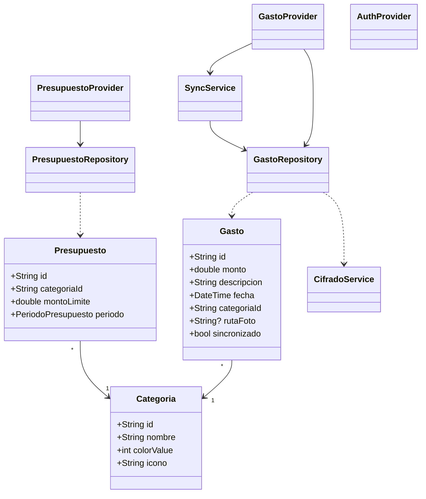
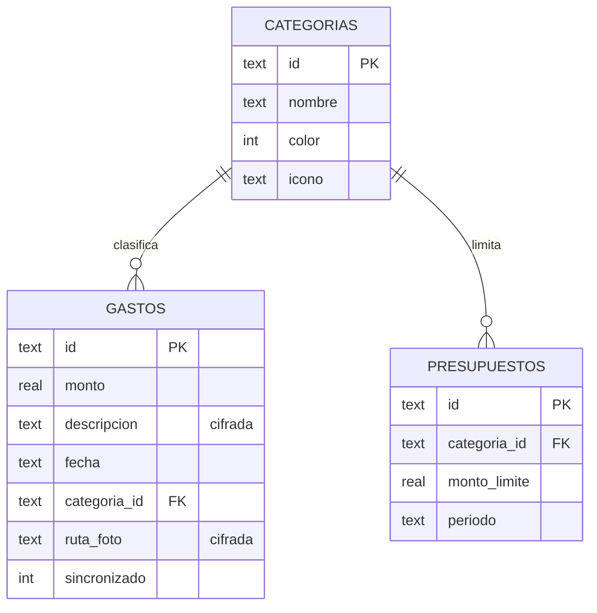

## Diagrama de clases

```mermaid
classDiagram
  class Categoria {
    +String id
    +String nombre
    +int colorValue
    +String icono
  }
  class Gasto {
    +String id
    +double monto
    +String descripcion
    +DateTime fecha
    +String categoriaId
    +String? rutaFoto
    +bool sincronizado
  }
  class Presupuesto {
    +String id
    +String categoriaId
    +double montoLimite
    +PeriodoPresupuesto periodo
  }
  class GastoRepository
  class PresupuestoRepository
  class CifradoService
  class SyncService
  class GastoProvider
  class PresupuestoProvider
  class AuthProvider

  Gasto "*" --> "1" Categoria
  Presupuesto "*" --> "1" Categoria
  GastoRepository ..> Gasto
  GastoRepository ..> CifradoService
  PresupuestoRepository ..> Presupuesto
  GastoProvider --> GastoRepository
  GastoProvider --> SyncService
  PresupuestoProvider --> PresupuestoRepository
  SyncService --> GastoRepository
```

## Modelo de datos

```mermaid
erDiagram
  CATEGORIAS ||--o{ GASTOS : clasifica
  CATEGORIAS ||--o{ PRESUPUESTOS : limita
  CATEGORIAS {
    text id PK
    text nombre
    int color
    text icono
  }
  GASTOS {
    text id PK
    real monto
    text descripcion "cifrada"
    text fecha
    text categoria_id FK
    text ruta_foto "cifrada"
    int sincronizado
  }
  PRESUPUESTOS {
    text id PK
    text categoria_id FK
    real monto_limite
    text periodo
  }
```